# Apresentação

O website “Encontre aqui” é uma aplicação que visa otimizar o processo de devolução de objetos achados e perdidos. Quando um objeto é perdido dificilmente é possível recuperá-lo, pois não há muito o que fazer além de postar em redes sociais e torcer para que quem achou visualize e entre em contato. Do outro lado, quem achou também fica sem opções viáveis para efetuar a devolução, pois objetos perdidos dificilmente possuem identificadores eficientes. Além do risco de que pessoas entrem em contato com intenções criminosas, como aplicação de golpes e similares. Assim, a missão da “Encontre aqui” é reunir itens achados e perdidos e viabilizar a devolução de forma segura.

 

# Principais definições e regras

 

- **Item**: objeto cadastrado por um usuário, que pode ser tanto achado quanto perdido. Itens perdidos podem ser reivindicados como achados e vice-versa. Um item cadastrado como perdido que é reivindicado, significa que o usuário o encontrou na lista e pretende devolvê-lo. Um item cadastrado como achado que é reivindicado, significa que o usuário (dono do item) o encontrou na lista e quer que a pessoa que o encontrou devolva-o.
- **Reivindicar item**: é o ato de solicitar a análise para devolução do item. Quem perdeu reivindica a devolução e quem achou faz o mesmo. A empresa é responsável por verificar a veracidade das informações e viabilizar a devolução do item.

 

# Funcionalidades do Usuário

## Landing page

 

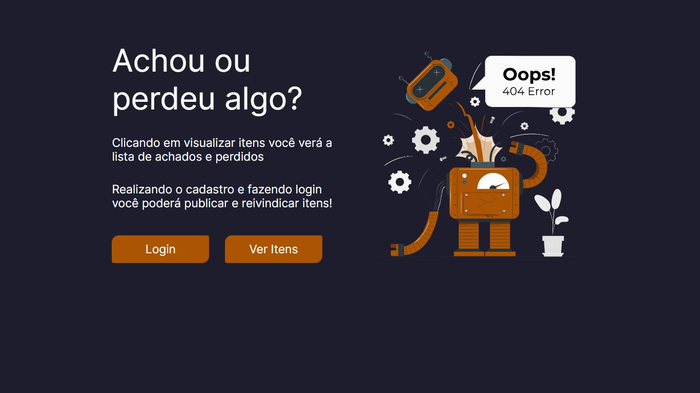

 

A landing page é a página padrão do website. Nela existem dois botões **Login** e **Ver itens**. O primeiro redireciona para o login do usuário e a segunda é o modo anônimo da aplicação.

 

## Modo anônimo

 

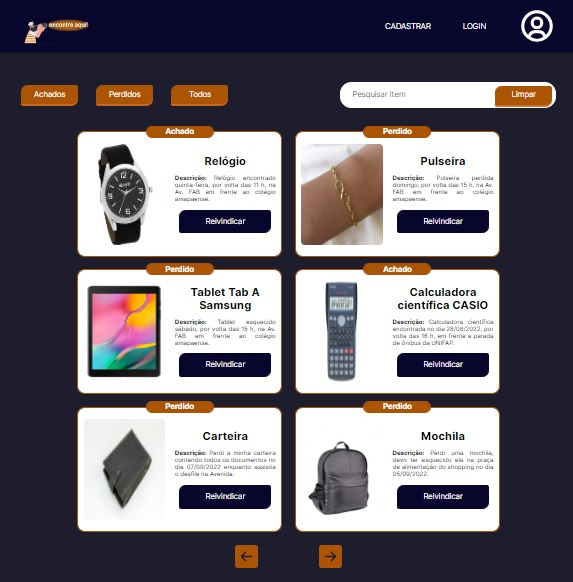

 

No modo anônimo qualquer usuário pode ver a lista de itens cadastrados, filtrá-los através dos botões **Achados**, **Perdidos** ou **Todos**, bem como pesquisar um item específico na barra de pesquisa. No header estão presentes a logomarca da “Encontre aqui” e os atalhos para o login e cadastro. O layout padrão apresenta seis cards com as seguintes informações dos itens cadastrados: imagem, nome, descrição e botão de reivindicar. O modo de reivindicar é bloqueado no modo anônimo, apenas usuários logados podem fazê-lo. A paginação dos itens é feita pelas setas de esquerda (voltar seis cards na lista de itens) e direita (avançar seis cards na lista de itens).

 

## Login

 

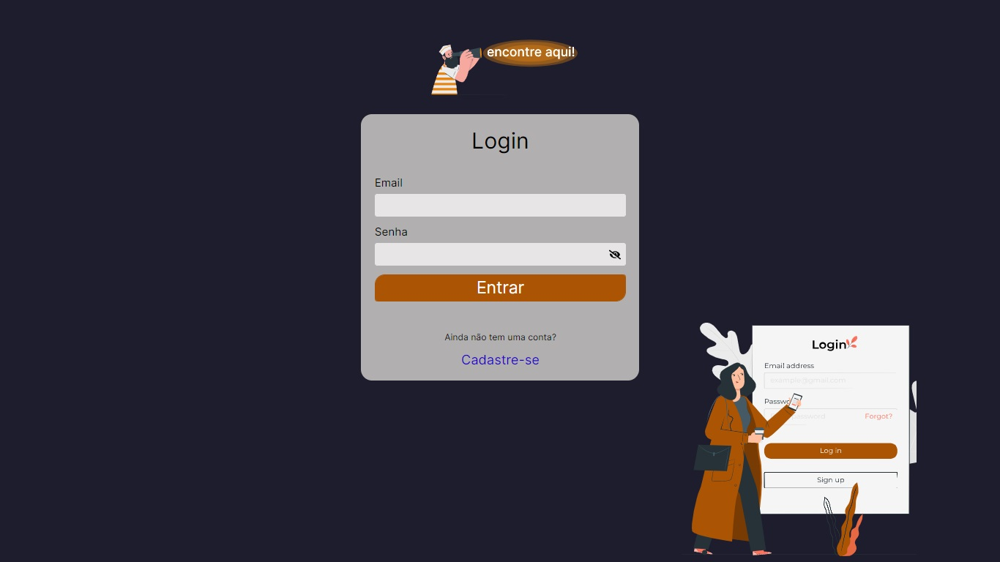

 

Caso o usuário seja cadastrado, pode efetuar o login através do seu e-mail e senha. Além disso, o usuário pode ser direcionado para a tela de cadastro através do link **Cadastre-se**. Caso o login seja bem sucedido, é apresentado um modal de sucesso e o usuário é direcionado para a sua dashboard, caso contrário, um modal de erro surge e o usuário permanece na página.

 

## Cadastro

 

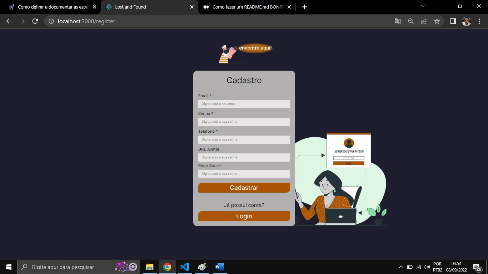

 

Na tela de cadastro são solicitadas as seguintes informações do usuário que pretende utilizar o website: e-mail, senha, telefone, avatar e uma rede social. Todos os campos são obrigatórios. Em caso de desconformidade com algum dos dados solicitados, são disparadas animações de erro nos inputs e orientações de preenchimento. Caso o cadastro seja bem sucedido, é disparado um modal de sucesso, do contrário, um modal de erro. Também, existe um botão de **Login** que direciona o usuário para a respectiva página.

 

## Dashboard do Usuário

 

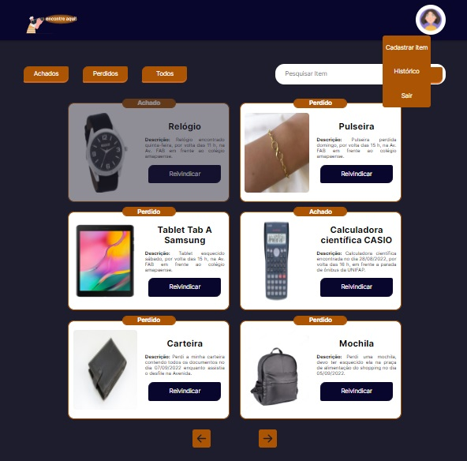

 

Assim como no modo anônimo, o usuário logado pode ver a lista de itens cadastrados, filtrá-los através dos botões **Achados**, **Perdidos** ou **Todos**, bem como pesquisar um item específico na barra de pesquisa. Caso o usuário possua um item cadastrado ou reivindicado o mesmo é apresentado na lista com um background destacado, que indica impossibilidade de interação com o card. A aplicação não permite que o usuário faça uma segunda reivindicação ou que reivindique seus itens cadastrados. Ao passar o mouse pelo seu avatar, surge um dropdown com as seguintes funcionalidades: **Cadastrar item**, **Histórico** e **Sair**.

 

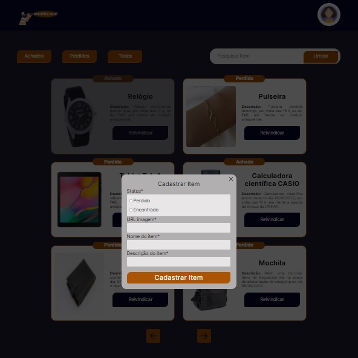

 

Ao clicar em **Cadastar item** surge um modal de cadastro, que solicita as seguintes informações: status do item (perdido ou achado), uma url com a imagem do item, nome e descrição do item. Caso o cadastro seja bem sucedido um modal de sucesso é mostrado e o item é listado na dashboard, do contrário, é apresentado um modal de erro. Ao clicar em **Histórico** os filtros e a lista de itens gerais dão lugar as listas de itens cadastrados e reivindicados pelo usuário, também, o botão de **Histórico** dá lugar ao botão de **Vitrine**, que redireciona o usuário para o layout anterior (com os filtros e a lista geral de itens).

 

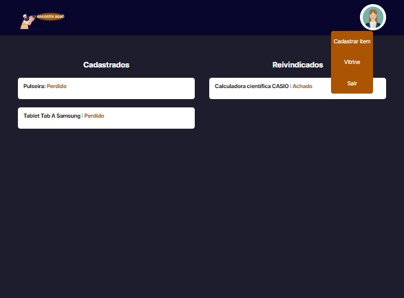

 

Na lista de cadastrados, ao clicar, é possível obter detalhes do item, bem como modificar suas informações ou excluí-lo por meio do botão de editar.

 

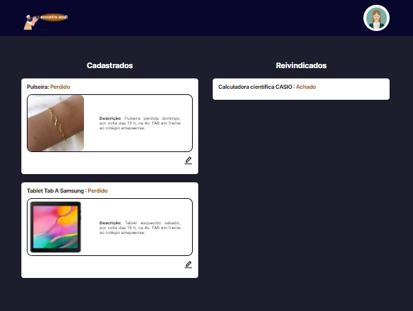

 

Ao clicar no botão de editar surge um modal para atualizar os dados do item cadastrado ou para deletá-lo. Caso a atualização ou exclusão seja bem sucedida, surge um modal de sucesso, do contrário, um modal de erro é apresentado. Caso existam reinvidicações vinculados ao item excluído, estas também serão excluídas do banco de dados.

 

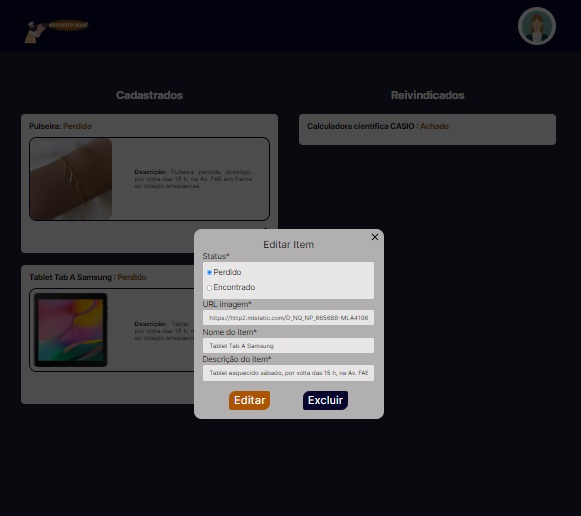

 

Na lista de reivindicados, ao clicar, é possível obter detalhes do item reivindicado, bem como excluí-lo. Caso a exclusão seja bem sucedida, um modal de sucesso é apresentado, do contrário, surge um modal de erro. Quando uma reivindicação é excluída pelo usuário, o item vinculado não é excluído do banco de dados.

 

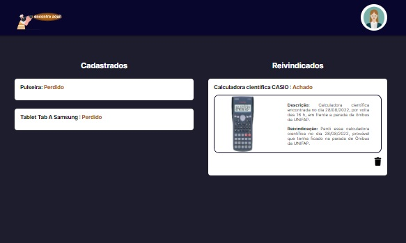

 

Caso o usuário clique um **Sair**, será redirecionado para a tela de login. De volta a dashboard, ao clicar no botão **Vitrine**, o usuário pode reivindicar um item que não esteja bloqueado na tela. Ao reivindicar, surge um modal solicitando uma descrição. Caso a reivindicação seja bem sucedida, um modal de sucesso é apresentado, do contrário, surge um modal de erro. Ao reivindicar com sucesso, as informações do item, do usuário requerido (que cadastrou o item) e do usuário requerente (que reivindicou o item), juntamente com sua descrição, são enviadas para a dashboard da empresa para análise.

 

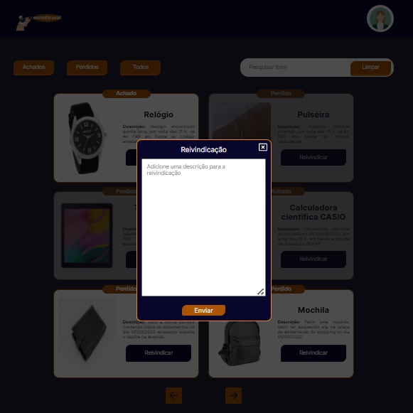

 

# Funcinalidades da Empresa

 

A empresa possui uma rota própria, com restrição de login (apenas admin), ou seja, apenas usuário pré-cadastrados (funcionários) tem acesso ao dashboard da empresa.

 

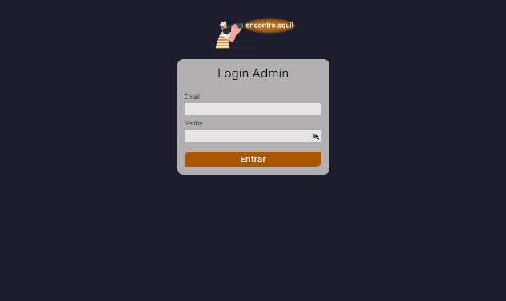

 

Na dashboard da empresa são listas todas as reivindicações feitas pelos usuários, identificadas pelos respectivos ids.

 

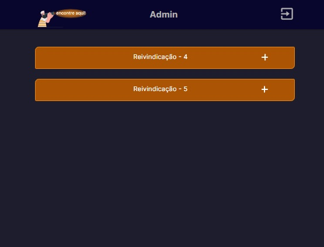

 

Ao clicar na reivindicação são apresentados seus detalhes, como o item reivindicado, o usuário que cadastrou o item (requerido) e o usuário que o reivindicou, juntamente com sua descrição.

 

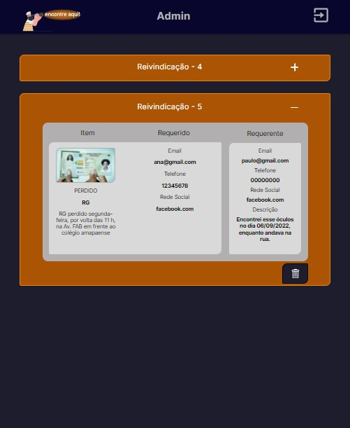

 

De posse dessas informações a empresa entra em contato com os usuários, solicita e cruza informações e caso seja constatada a sua integridade, a devolução do item é viabilidade por meio de serviço de entrega de terceiros. É cobrado um valor do usuário que deseja recuperar o item e é paga uma taxa para o usuário que devolver o item.
